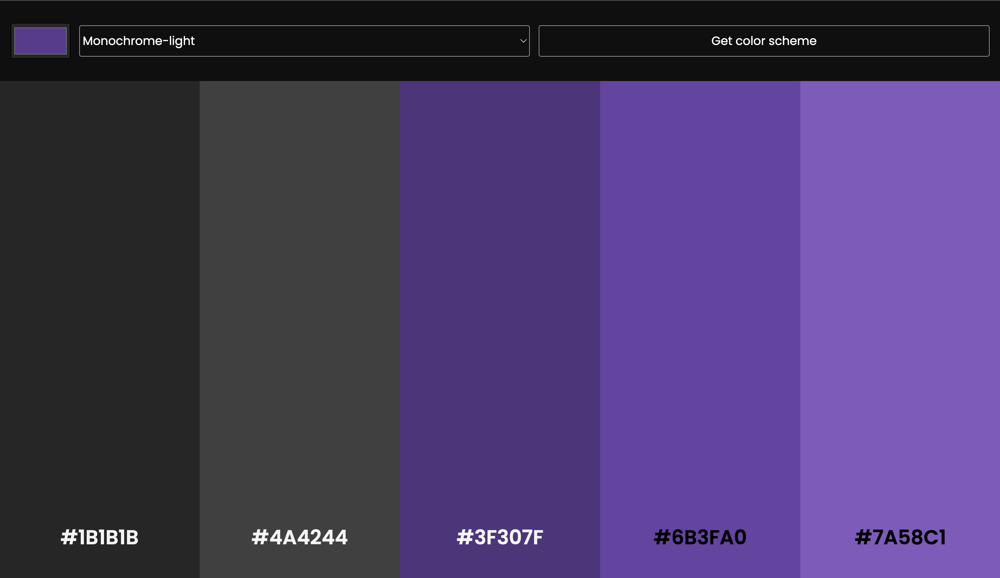

# Colortopia

A color scheme generator of your chosen color application built with HTML, CSS, and JavaScript.

## Description

This tool fetches an api from https://www.thecolorapi.com/ (its free & doesn't need authentication), parameters like base color, mode (monochrome, analogous, complementary, etc.) with a clean, user-friendly interface.

## How to Use

1. Clone this repository or download the files
2. Open `index.html` in your web browser
3. Alternatively, visit the live demo: 

## Features

- Generate color schemes from a base color
- Multiple color harmony options (complementary, analogous, triadic, etc.)
- Copy color codes with a single click
- Displays & adjusts the color of the color's hex value based on its opacity
- Responsive design that works on mobile and desktop

## Technologies Used

- HTML5
- CSS3
- JavaScript

## Preview

